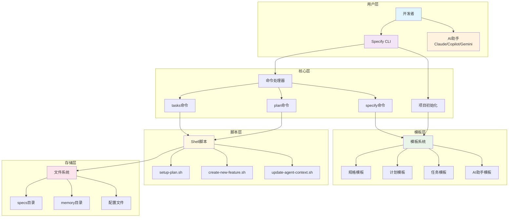
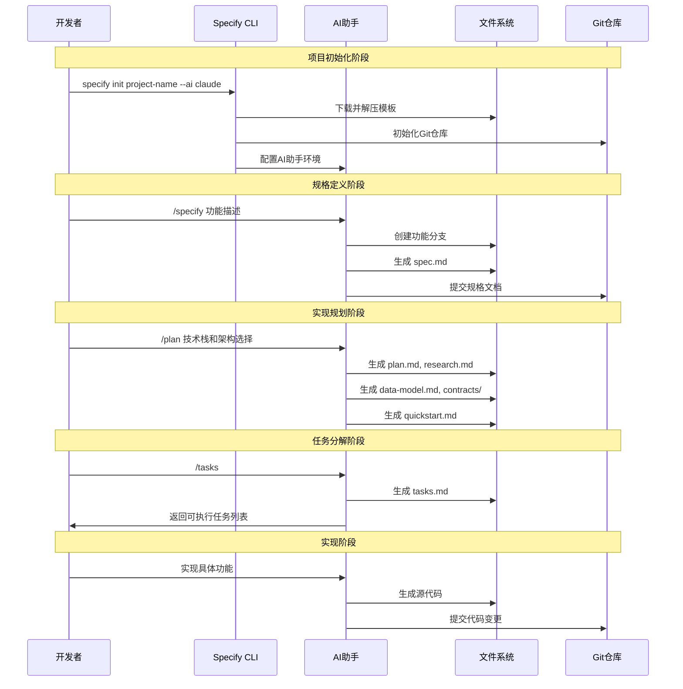
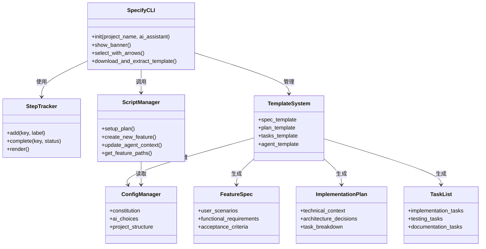
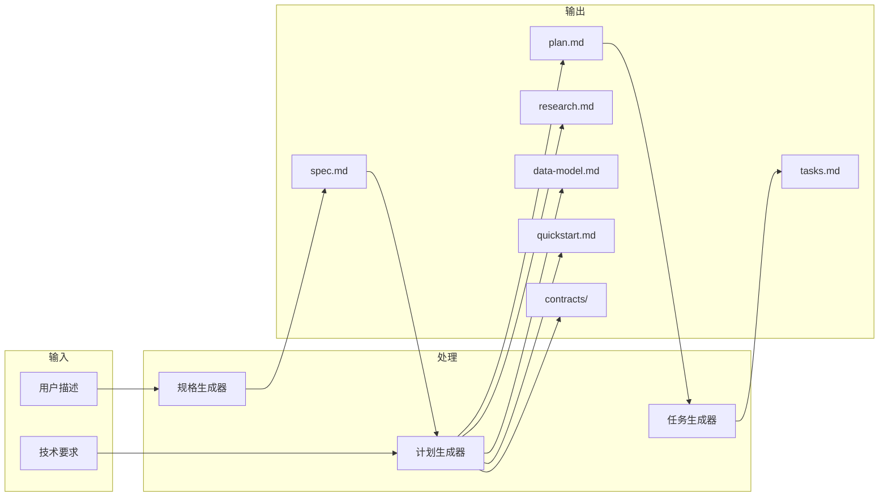

# Spec Kit 技术文档

## 目录

- [项目概述](#项目概述)
- [技术栈说明](#技术栈说明)
- [项目架构设计](#项目架构设计)
- [目录结构详细说明](#目录结构详细说明)
- [安装和运行指南](#安装和运行指南)
- [核心功能模块详解](#核心功能模块详解)
- [数据流程说明](#数据流程说明)
- [配置文件说明](#配置文件说明)
- [开发指南和最佳实践](#开发指南和最佳实践)
- [常见问题和故障排除](#常见问题和故障排除)

## 项目概述

### 什么是 Spec Kit？

Spec Kit 是一个革命性的软件开发工具包，实现了"规格驱动开发"（Spec-Driven Development）的理念。它颠覆了传统的软件开发模式，将规格说明书从辅助文档转变为可执行的核心，直接生成工作实现而不仅仅是指导开发。

### 核心价值

- **意图驱动开发**：先定义"是什么"和"为什么"，再考虑"怎么做"
- **多步骤精化**：通过结构化流程逐步完善，而非一次性代码生成
- **AI 协作**：深度依赖先进AI模型的规格解释能力
- **技术无关性**：支持多种技术栈和架构选择

### 主要功能

1. **项目初始化**：快速创建符合规格驱动开发的项目结构
2. **规格生成**：通过 `/specify` 命令创建详细的功能规格
3. **实现规划**：通过 `/plan` 命令制定技术实现方案
4. **任务分解**：通过 `/tasks` 命令生成可执行的任务列表
5. **AI 助手集成**：支持 Claude Code、GitHub Copilot、Gemini CLI

## 技术栈说明

### 核心技术

- **Python 3.11+**：主要编程语言
- **Typer**：现代化CLI框架，提供类型安全的命令行接口
- **Rich**：终端美化库，提供丰富的文本格式和进度显示
- **HTTPX**：现代异步HTTP客户端，用于下载模板
- **Platformdirs**：跨平台目录管理
- **Readchar**：键盘输入处理，支持交互式选择

### 构建工具

- **Hatchling**：现代Python包构建后端
- **uv**：快速Python包管理器（推荐）
- **Git**：版本控制系统

### 支持的AI助手

- **Claude Code**：Anthropic的AI编程助手
- **GitHub Copilot**：GitHub的AI编程助手  
- **Gemini CLI**：Google的AI命令行工具

## 项目架构设计

### 系统架构图



### 工作流程图



### 组件关系图



## 目录结构详细说明

### 根目录结构

```
spec-kit/
├── src/                    # 源代码目录
│   └── specify_cli/        # CLI工具实现
├── scripts/                # Shell脚本工具
├── templates/              # 模板文件
├── memory/                 # 项目记忆和约束
├── media/                  # 媒体资源
├── pyproject.toml          # Python项目配置
├── README.md               # 项目说明
└── 其他文档文件...
```

### 详细目录说明

#### `/src/specify_cli/`
- **作用**：CLI工具的核心实现
- **主要文件**：
  - `__init__.py`：CLI入口点，包含所有命令实现
- **功能**：项目初始化、模板下载、AI助手配置

#### `/scripts/`
- **作用**：支持开发流程的Shell脚本
- **主要文件**：
  - `common.sh`：通用函数库
  - `setup-plan.sh`：设置实现计划结构
  - `create-new-feature.sh`：创建新功能分支
  - `update-agent-context.sh`：更新AI助手上下文
  - `get-feature-paths.sh`：获取功能相关路径
  - `check-task-prerequisites.sh`：检查任务前置条件

#### `/templates/`
- **作用**：各种文档和配置模板
- **主要文件**：
  - `spec-template.md`：功能规格模板
  - `plan-template.md`：实现计划模板
  - `tasks-template.md`：任务列表模板
  - `agent-file-template.md`：AI助手配置模板
  - `commands/`：AI助手命令定义

#### `/memory/`
- **作用**：项目约束和开发原则
- **主要文件**：
  - `constitution.md`：项目宪法（开发原则）
  - `constitution_update_checklist.md`：宪法更新检查清单

## 安装和运行指南

### 环境要求

- **操作系统**：Linux、macOS 或 Windows WSL2
- **Python**：3.11 或更高版本
- **Git**：用于版本控制
- **uv**：Python包管理器（推荐）
- **AI助手**：Claude Code、GitHub Copilot 或 Gemini CLI 之一

### 安装步骤

#### 1. 安装 Python 和 uv

```bash
# 安装 uv（如果尚未安装）
curl -LsSf https://astral.sh/uv/install.sh | sh

# 验证安装
uv --version
python --version  # 应该是 3.11+
```

#### 2. 安装 Specify CLI

```bash
# 直接从 GitHub 安装
uvx --from git+https://github.com/github/spec-kit.git specify init <PROJECT_NAME>

# 或者克隆仓库后本地安装
git clone https://github.com/github/spec-kit.git
cd spec-kit
uv tool install .
```

#### 3. 验证安装

```bash
specify --help
```

### 快速开始

#### 1. 创建新项目

```bash
# 创建新项目目录
specify init my-awesome-project

# 或在当前目录初始化
specify init --here
```

#### 2. 选择AI助手

安装过程中会提示选择AI助手：
- **Claude Code**：需要安装 Claude Code
- **GitHub Copilot**：需要安装 VS Code 和 Copilot 扩展
- **Gemini CLI**：需要安装 Gemini CLI 工具

#### 3. 启动开发流程

```bash
# 进入项目目录
cd my-awesome-project

# 启动AI助手（以Claude为例）
claude

# 在AI助手中使用命令
/specify 构建一个照片管理应用...
/plan 使用 React + Node.js + SQLite...
/tasks
```

## 核心功能模块详解

### 1. 项目初始化模块

**文件位置**：`src/specify_cli/__init__.py` 中的 `init()` 函数

**主要功能**：
- 检查系统环境和依赖
- 下载最新的项目模板
- 配置AI助手环境
- 初始化Git仓库

**关键代码示例**：

```python
@app.command()
def init(
    project_name: str = typer.Argument(None),
    ai_assistant: str = typer.Option(None, "--ai"),
    ignore_agent_tools: bool = typer.Option(False, "--ignore-agent-tools"),
    no_git: bool = typer.Option(False, "--no-git"),
    here: bool = typer.Option(False, "--here"),
):
    """初始化新的 Specify 项目"""
```

### 2. 模板系统

**文件位置**：`/templates/` 目录

**核心模板**：

1. **规格模板** (`spec-template.md`)
   - 定义功能需求的结构
   - 包含用户场景、验收标准、功能需求
   - 提供质量检查清单

2. **计划模板** (`plan-template.md`)
   - 技术实现方案的框架
   - 包含架构决策、技术栈选择
   - 定义实现阶段和里程碑

3. **任务模板** (`tasks-template.md`)
   - 可执行任务的分解结构
   - 包含开发、测试、文档任务
   - 提供进度跟踪机制

### 3. 脚本管理系统

**文件位置**：`/scripts/` 目录

**核心脚本**：

1. **setup-plan.sh**
   - 设置实现计划的目录结构
   - 复制相关模板文件
   - 返回路径信息供其他工具使用

2. **create-new-feature.sh**
   - 创建新的功能分支
   - 设置功能开发环境
   - 初始化相关文档结构

3. **update-agent-context.sh**
   - 更新AI助手的上下文信息
   - 同步项目状态和配置
   - 支持多种AI助手格式

### 4. 配置管理

**文件位置**：`/memory/constitution.md`

**核心原则**：
- 库优先开发
- CLI接口标准
- 测试驱动开发
- 集成测试要求
- 可观测性标准

## 数据流程说明

### 完整开发流程

```mermaid
flowchart TD
    Start([开始]) --> Init[项目初始化]
    Init --> Specify[/specify 命令]
    Specify --> SpecDoc[生成规格文档]
    SpecDoc --> Review1{规格审查}
    Review1 -->|需要修改| Specify
    Review1 -->|通过| Plan[/plan 命令]
    
    Plan --> Research[技术研究]
    Research --> Architecture[架构设计]
    Architecture --> DataModel[数据模型]
    DataModel --> Contracts[接口契约]
    Contracts --> Review2{计划审查}
    Review2 -->|需要修改| Plan
    Review2 -->|通过| Tasks[/tasks 命令]
    
    Tasks --> TaskList[任务列表]
    TaskList --> Implementation[代码实现]
    Implementation --> Testing[测试验证]
    Testing --> Review3{质量审查}
    Review3 -->|需要修改| Implementation
    Review3 -->|通过| Deploy[部署发布]
    Deploy --> End([完成])
    
    style Start fill:#e1f5fe
    style End fill:#e8f5e8
    style Review1 fill:#fff3e0
    style Review2 fill:#fff3e0
    style Review3 fill:#fff3e0
```

### 文件生成流程



## 配置文件说明

### pyproject.toml

这是Python项目的核心配置文件，定义了：

```toml
[project]
name = "specify-cli"                    # 项目名称
version = "0.0.2"                      # 版本号
description = "Setup tool for Specify spec-driven development projects"
requires-python = ">=3.11"             # Python版本要求
dependencies = [                        # 核心依赖
    "typer",        # CLI框架
    "rich",         # 终端美化
    "httpx",        # HTTP客户端
    "platformdirs", # 目录管理
    "readchar",     # 键盘输入
]

[project.scripts]
specify = "specify_cli:main"            # CLI入口点

[build-system]
requires = ["hatchling"]                # 构建工具
build-backend = "hatchling.build"
```

### AI助手配置

项目支持三种AI助手，每种都有特定的配置格式：

1. **Claude Code**: `CLAUDE.md`
2. **GitHub Copilot**: `.github/copilot-instructions.md`  
3. **Gemini CLI**: `GEMINI.md`

这些文件包含：
- 项目上下文信息
- 可用命令列表
- 代码风格指南
- 最近的变更记录

## 开发指南和最佳实践

### 代码风格

1. **Python代码规范**
   - 遵循 PEP 8 标准
   - 使用类型注解
   - 编写清晰的文档字符串

2. **CLI设计原则**
   - 提供清晰的帮助信息
   - 支持 `--help` 和 `--version` 选项
   - 使用一致的参数命名

3. **错误处理**
   - 提供有意义的错误消息
   - 使用适当的退出码
   - 记录详细的调试信息

### 开发工作流

1. **功能开发**
   ```bash
   # 创建功能分支
   git checkout -b 001-new-feature
   
   # 使用规格驱动开发流程
   /specify 新功能描述
   /plan 技术实现方案
   /tasks
   ```

2. **测试策略**
   - 单元测试：测试独立组件
   - 集成测试：测试组件交互
   - 端到端测试：测试完整流程

3. **文档维护**
   - 保持README.md更新
   - 更新技术文档
   - 维护API文档

### 扩展指南

1. **添加新的AI助手支持**
   - 在 `AI_CHOICES` 中添加新选项
   - 创建对应的模板文件
   - 更新配置脚本

2. **添加新的模板类型**
   - 在 `/templates/` 目录创建新模板
   - 更新模板处理逻辑
   - 添加相应的测试

3. **扩展脚本功能**
   - 遵循现有脚本的结构
   - 使用 `common.sh` 中的通用函数
   - 添加适当的错误处理

## 常见问题和故障排除

### 安装问题

**Q: 安装时提示 Python 版本不兼容**
```bash
# 检查Python版本
python --version

# 如果版本低于3.11，请升级Python
# 在macOS上使用Homebrew
brew install python@3.11

# 在Ubuntu上
sudo apt update
sudo apt install python3.11
```

**Q: uv 命令未找到**
```bash
# 重新安装uv
curl -LsSf https://astral.sh/uv/install.sh | sh

# 重新加载shell配置
source ~/.bashrc  # 或 ~/.zshrc
```

### 使用问题

**Q: AI助手命令不可用**
- 确保已正确安装对应的AI助手工具
- 检查项目是否已正确初始化
- 验证模板文件是否存在

**Q: 模板下载失败**
```bash
# 检查网络连接
ping github.com

# 使用 --ignore-agent-tools 跳过工具检查
specify init project-name --ignore-agent-tools
```

**Q: Git 认证问题**
```bash
# 在Linux上安装Git Credential Manager
wget https://github.com/git-ecosystem/git-credential-manager/releases/download/v2.6.1/gcm-linux_amd64.2.6.1.deb
sudo dpkg -i gcm-linux_amd64.2.6.1.deb
git config --global credential.helper manager
```

### 开发问题

**Q: 脚本执行权限错误**
```bash
# 给脚本添加执行权限
chmod +x scripts/*.sh
```

**Q: 模板变量未正确替换**
- 检查模板文件格式
- 验证变量名称是否正确
- 确保脚本逻辑正确处理变量替换

### 性能优化

1. **减少模板下载时间**
   - 使用本地缓存
   - 选择合适的下载源

2. **优化脚本执行速度**
   - 减少不必要的文件操作
   - 使用并行处理

3. **改善用户体验**
   - 提供进度指示
   - 优化错误消息
   - 简化命令参数

---

## 学习资源

- [Typer 官方文档](https://typer.tiangolo.com/)
- [Rich 库文档](https://rich.readthedocs.io/)
- [Python 包管理最佳实践](https://packaging.python.org/)
- [Git 工作流指南](https://www.atlassian.com/git/tutorials/comparing-workflows)

---

**文档版本**: 1.0  
**最后更新**: 2025-09-08  
**维护者**: Spec Kit 开发团队
